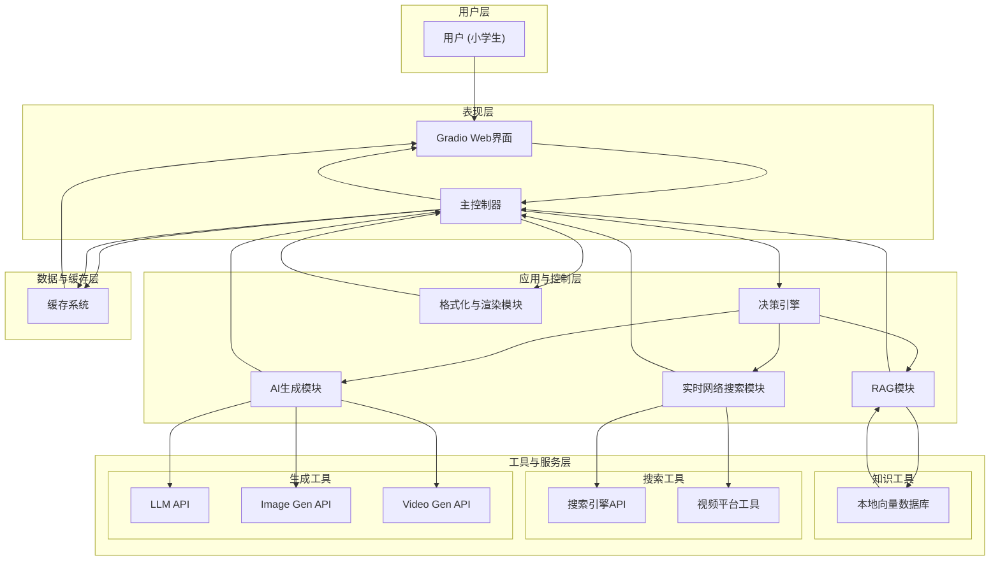

### **项目方案书：中关村三小 AI 实时校情浏览器**

#### **第一部分：系统架构图**

这份架构图展示了整个系统的数据流和模块交互关系。

---

#### **第二部分：关键问题与潜在风险 (Pre-Mortem Analysis)**

在开始开发前，必须正视以下现实问题。这些是您在开发过程中最可能遇到的“坑”。

**1. API 成本与配额管理**
*   **问题：** 您是个人出资，而多模态和生成式API的调用成本高昂且难以预估。免费额度一旦用尽，项目将无法运行。
*   **需要思考的关键点：**
    *   如何精确追踪每次查询的API成本？
    *   如何设置一个严格的每日/每月预算“熔断”机制，防止意外的高额账单？
    *   如果核心API（如视频生成）的免费额度耗尽，是否有备用（降级）方案？例如，从生成视频降级为展示动图或多张图片。
    *   孩子的自由探索会不会导致API调用失控？

**2. 性能、延迟与用户体验**
*   **问题：** 一个包含“搜索 -> 总结 -> 图片查找 -> 视频生成”的完整流程，耗时可能长达1-2分钟。对于小学生来说，超过30秒的等待就等于失败。
*   **需要思考的关键点：**
    *   如何设计一个真正有效的异步任务处理流程，确保Gradio界面在后端处理时不会冻结？
    *   除了“正在加载...”，如何向孩子提供更具体、更有趣的进度反馈？（例如：“我正在B站帮你找视频哦！”）
    *   当某个外部API（如Tavily, Replicate）响应缓慢或超时时，我们的超时和重试策略是什么？如何优雅地处理失败，而不是直接报错？

**3. 内容安全、准确性与相关性**
*   **问题：** 网络是开放的，即使开启了安全搜索，也无法100%保证搜索结果（特别是图片和视频）完全适合儿童，或与查询高度相关。同时，LLM本身存在“幻觉”，可能编造校史。
*   **需要思考的关键点：**
    *   当搜索到的图片/视频质量不高或相关性差时，系统的筛选和排序逻辑是什么？是自动选择第一张，还是进行某种评估？
    *   对于LLM总结的内容，如何与您的本地知识库（RAG）进行交叉验证，以确保事实的准确性？
    *   是否需要一个额外的、更严格的内容审核层（例如，调用专门的内容审核API）来处理所有从网络获取的文本和图片？

**4. 图生视频的实际效果与期望管理**
*   **问题：** 当前的图生视频技术（如SVD）仍处于早期阶段，其效果可能不稳定。对于“让教室里的学生动起来”这类具体指令，模型可能无法准确理解，生成的结果可能怪异、不自然，甚至令人失望。
*   **需要思考的关键点：**
    *   如何管理孩子的期望值？需要提前让他了解AI生成能力的局限性。
    *   如何设计后端的Prompt，才能最大化地引导模型生成我们想要的效果？这需要大量的实验和调整。
    *   当生成效果不佳时，是否提供“再试一次”的选项？但这会加倍成本。

---

#### **第三部分：项目总纲 (Consolidated Plan)**

这是对我们之前所有讨论的最终汇总，是您项目的行动蓝图。

**A. 最终需求规格**

*   **核心功能：**
    1.  **混合式智能问答：** 结合本地知识库（RAG）与实时网络搜索，回答关于校史和学校最新动态的问题。
    2.  **实时信息检索：** 能联网搜索新闻、图片，并从B站等平台检索视频（展示封面和标题，点击跳转）。
    3.  **多模态内容生成：** 支持基于文本的图片生成和基于搜索图片的视频生成。
    4.  **零成本示例演示：** 首页提供预设问题，点击后从缓存瞬时加载结果，用于无延迟、零成本的展示。
*   **界面与体验：**
    1.  **现代化UI：** 采用Gradio构建，界面美观，支持自定义学校背景图片。
    2.  **清晰的交互：** 输入、输出、功能按钮区域分离，逻辑清晰。
    3.  **明确的加载反馈：** 对耗时任务提供明确、分步的进度提示。
    4.  **高质量内容渲染：** 完美解析和展示Markdown格式，特别是表格和列表。
*   **孩子参与模式：**
    1.  **角色：** 项目总指挥、内容策划官、首席创意官、最终验收官。
    2.  **任务：** 负责提供校史资料、定义示例问题、挑选UI元素、测试并提出修改意见。

**B. 最终技术栈与解决方案**

| 模块 | 技术选型 | 解决方案与实施要点 |
| :--- | :--- | :--- |
| **Web UI & 服务端** | Gradio | 作为项目唯一的界面和后端服务载体。 |
| **Markdown渲染** | `gr.HTML` + `markdown-it-py` + 自定义CSS | 后端将Markdown转为HTML，注入自定义CSS类，再由Gradio的HTML组件进行渲染，实现完全的样式控制。 |
| **RAG知识库** | 本地文本文件 + FAISS | 建立一个轻量级的本地向量索引，用于快速、低成本地回答确定的校史问题。 |
| **实时网络搜索** | Tavily Search API | 专为AI应用设计的搜索引擎，能直接返回清洗和摘要后的内容，极大降低开发难度。 |
| **视频平台搜索** | `you-get` / `yt-dlp` | 通过Python的`subprocess`模块调用命令行，仅抓取视频元数据（标题、封面），实现零成本视频检索。 |
| **文本处理 (LLM)** | 智谱AI (GLM-4) / 阿里云通义千问 | 用于对话、总结网络搜索结果、对内容进行润色，使其适合儿童阅读。 |
| **图片/视频生成** | Replicate API / 智谱AI API | 调用成熟的API服务，实现文生图和图生视频功能。Replicate在开源模型的多样性上更有优势。 |
| **缓存机制** | Python `functools.lru_cache` + `json` 文件 | 内存缓存用于加速重复的动态查询，JSON文件用于固化示例任务的结果，实现零成本演示。 |
| **主控逻辑** | 自定义Python类 | 不引入复杂框架，通过一个主类来封装所有业务逻辑、路由和工具调用，保持代码清晰可控。 |
